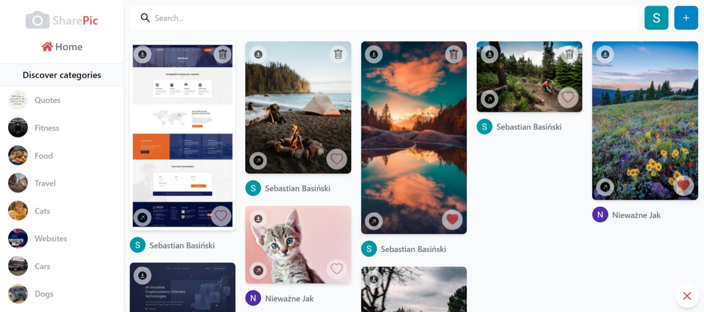
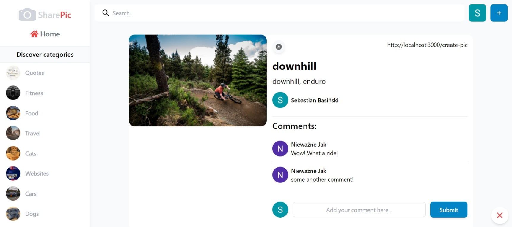
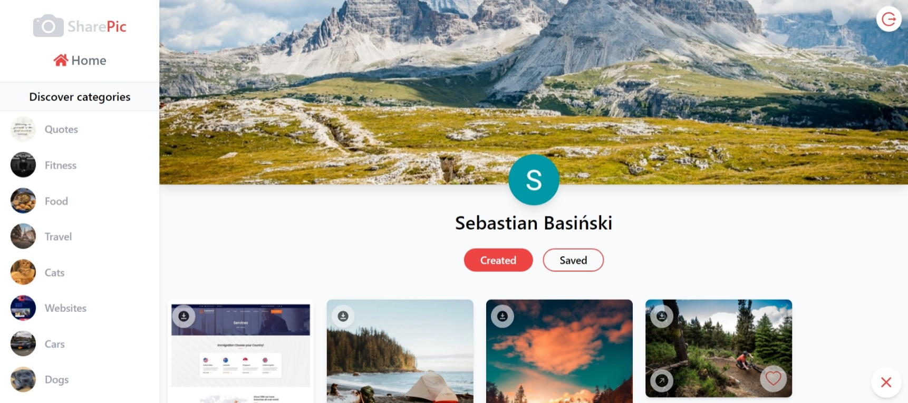

# Getting Started with Create React App

This project was bootstrapped with [Create React App](https://github.com/facebook/create-react-app)
and [CMS Sanity](https://www.sanity.io/).

You can login to the app with your google account.

## Available Scripts

In the project directory, you can run:

### `yarn start`

Runs the app in the development mode.\
Open [http://localhost:3000](http://localhost:3000) to view it in your browser.

The page will reload when you make changes.\
You may also see any lint errors in the console.

### CMS Sanity

CMS Sanity serves as a backend for this app. Files you can find inside studio directory.

### Live Link: [https://sharepic-app.netlify.app](https://sharepic-app.netlify.app)

### App Screens:

